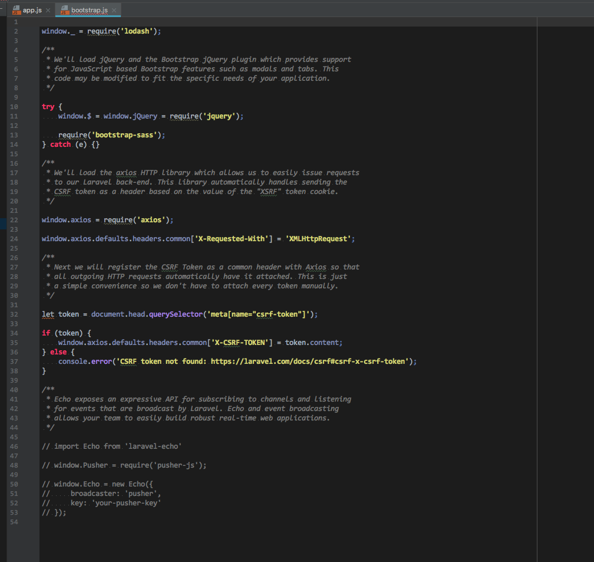
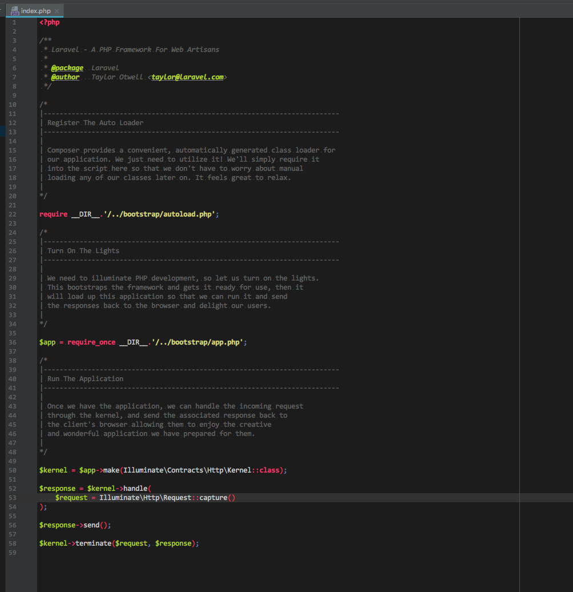

PHPStorm color scheme
===========

#### Installation macOS
* pull repo
* copy Gulios.icls to:(depends on PHPStorm version)
<pre>
/Users/USERR/Library/Preferences/PhpStorm2017.2/colors
</pre>
* set new color scheme in PHPStorm preferences

#### Installing 'Consolas' fonts

<pre>
$ brew install cabextract
$ cd ~/Downloads
$ mkdir consolas
$ cd consolas
$ curl -O http://download.microsoft.com/download/f/5/a/f5a3df76-d856-4a61-a6bd-722f52a5be26/PowerPointViewer.exe
$ cabextract PowerPointViewer.exe
$ cabextract ppviewer.cab
$ open CONSOLA*.TTF
</pre>

if installation fonts doesn't work than you cant cd "consolas-fonts" and run in terminal:
<pre>
open CONSOLA*.TTF
</pre>

Screenshot
----------
CSS

HTML

JS

PHP

XML
